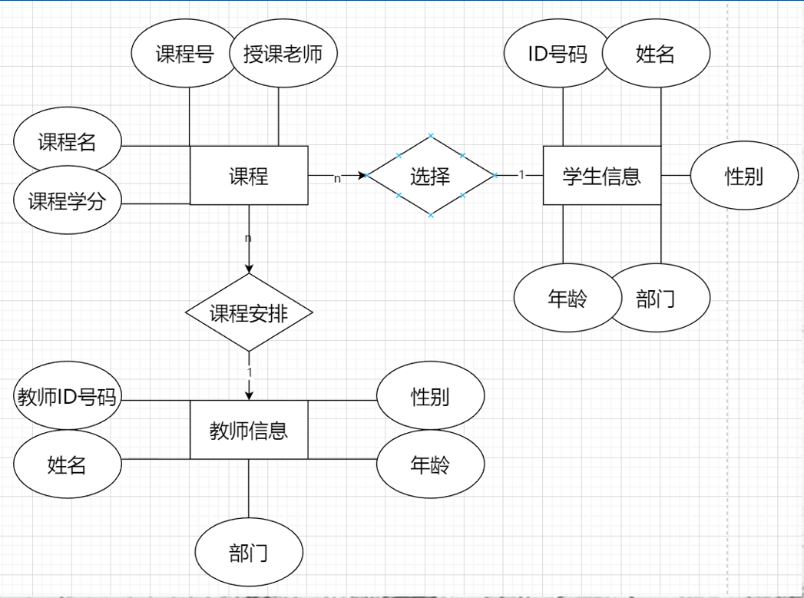
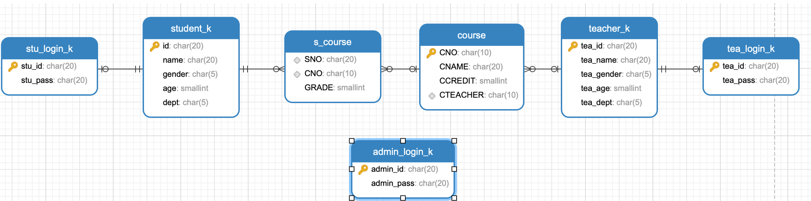
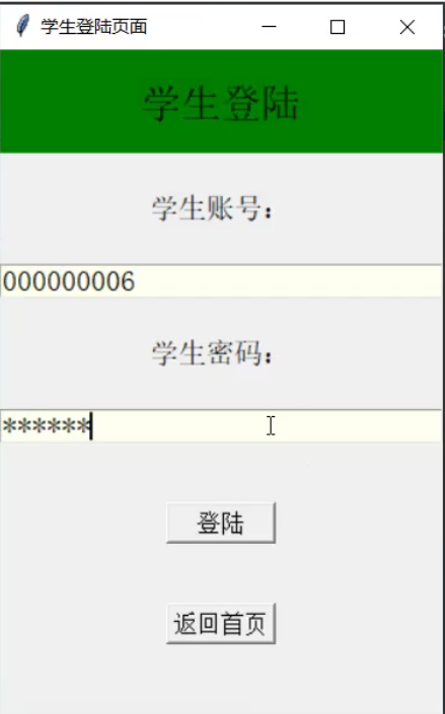
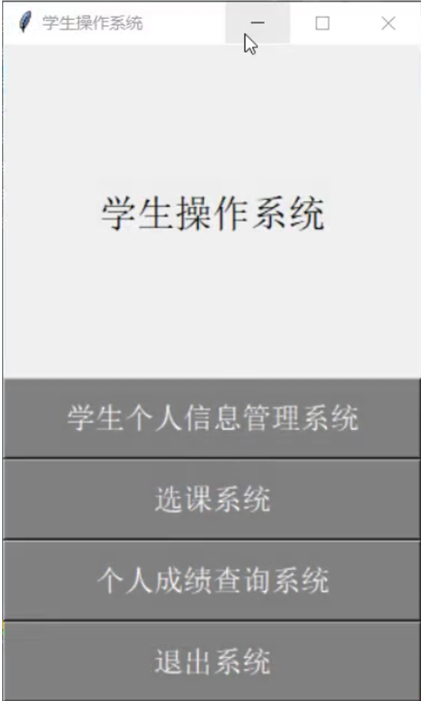
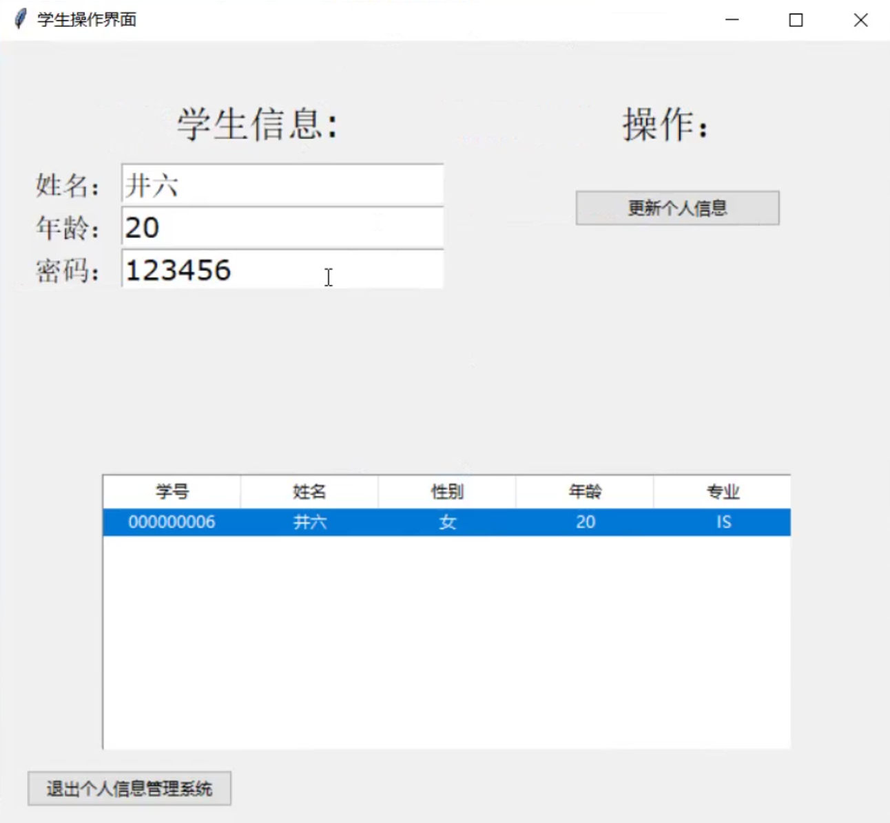
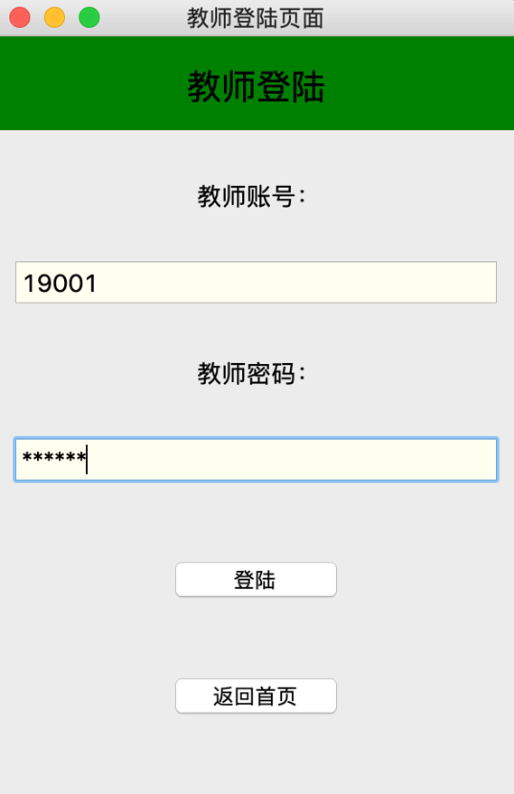
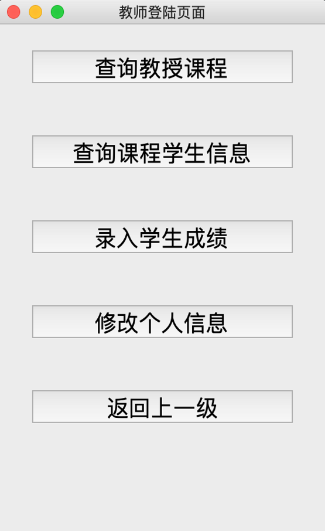
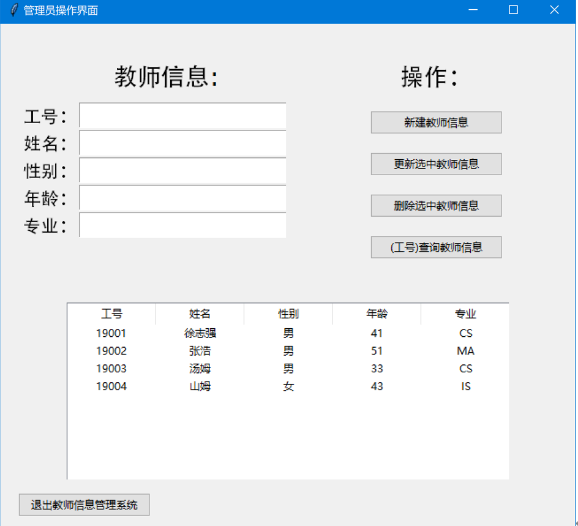
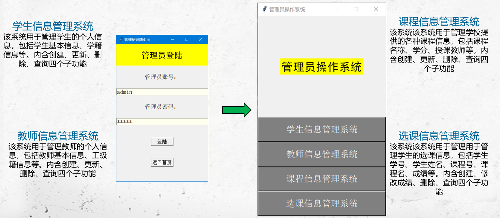
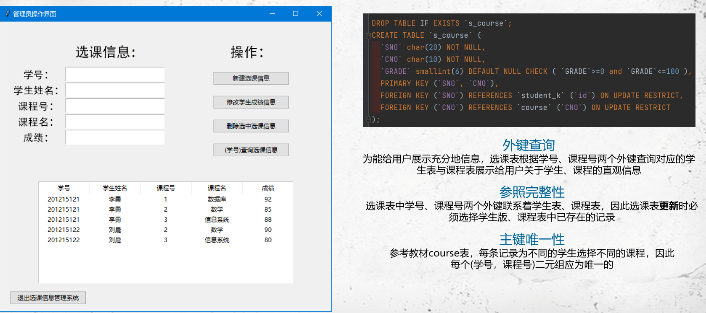

# 基于pymysql学生选课系统的设计与实现

C_N_U IE 的数据库原理课程设计，基于pymysql学生管理系统的设计与实现，包括学生端，教师端和管理员端页面与功能。


C_N_U IE's database principles course final design, design and implementation of pymysql based student course manage system


<!-- PROJECT LOGO -->
<p align="center">
  <a>
    
  </a>
</p>
<p align="center">
  <a>
    
  </a>
  <h3 align="center">ER图</h3>
  <p align="center">

</p>

## 目录

1. [演示视频](#演示视频)
2. [数据库概述](#数据库概述)
3. [表结构](#表结构)
    - [admin_login_k](#admin_login_k)
    - [course](#course)
    - [s_course](#s_course)
    - [stu_login_k](#stu_login_k)
    - [student_k](#student_k)
    - [tea_login_k](#tea_login_k)
    - [teacher_k](#teacher_k)
4. [数据示例](#数据示例)
5. [外键约束](#外键约束)

## 演示视频
https://github.com/user-attachments/assets/8c773fc3-14f9-4af5-a51e-0f15e9a34a89

## 数据库概述

此数据库是一个学校管理系统的示例数据库。该数据库包含学生、教师、课程及其关联信息，适用于模拟学校日常管理的需求。

## 表结构

### admin_login_k

- **描述**: 管理员登录信息表
- **字段**:
  - `admin_id`: 管理员ID，类型为 `char(20)`，主键
  - `admin_pass`: 管理员密码，类型为 `char(20)`

### course

- **描述**: 课程信息表
- **字段**:
  - `CNO`: 课程编号，类型为 `char(10)`，主键
  - `CNAME`: 课程名称，类型为 `char(20)`
  - `CCREDIT`: 课程学分，类型为 `smallint`
  - `CTEACHER`: 任课教师ID，类型为 `char(10)`

### s_course

- **描述**: 学生课程成绩表
- **字段**:
  - `SNO`: 学生编号，类型为 `char(20)`
  - `CNO`: 课程编号，类型为 `char(10)`
  - `GRADE`: 成绩，类型为 `smallint`

### stu_login_k

- **描述**: 学生登录信息表
- **字段**:
  - `stu_id`: 学生ID，类型为 `char(20)`，主键
  - `stu_pass`: 学生密码，类型为 `char(20)`

### student_k

- **描述**: 学生信息表
- **字段**:
  - `id`: 学生编号，类型为 `char(20)`，主键
  - `name`: 学生姓名，类型为 `char(20)`
  - `gender`: 学生性别，类型为 `char(5)`
  - `age`: 学生年龄，类型为 `smallint`
  - `dept`: 所在院系，类型为 `char(5)`

### tea_login_k

- **描述**: 教师登录信息表
- **字段**:
  - `tea_id`: 教师ID，类型为 `char(20)`，主键
  - `tea_pass`: 教师密码，类型为 `char(20)`

### teacher_k

- **描述**: 教师信息表
- **字段**:
  - `tea_id`: 教师编号，类型为 `char(20)`，主键
  - `tea_name`: 教师姓名，类型为 `char(20)`
  - `tea_gender`: 教师性别，类型为 `char(5)`
  - `tea_age`: 教师年龄，类型为 `smallint`
  - `tea_dept`: 所在院系，类型为 `char(5)`

## 数据示例

### admin_login_k 表数据

- 管理员 ID: `admin`
- 管理员密码: `admin`

### course 表数据

- 课程编号: `1`, 课程名称: `数据库`, 学分: `4`, 任课教师: `徐志强`
- 课程编号: `2`, 课程名称: `数学`, 学分: `2`, 任课教师: `张浩`
- 课程编号: `3`, 课程名称: `信息系统`, 学分: `4`, 任课教师: `汤姆`
- 课程编号: `4`, 课程名称: `操作系统`, 学分: `3`, 任课教师: `徐志强`
- 课程编号: `5`, 课程名称: `数据结构`, 学分: `4`, 任课教师: `山姆`
- 课程编号: `6`, 课程名称: `数据处理`, 学分: `2`, 任课教师: `汤姆`
- 课程编号: `7`, 课程名称: `PASCAL语言`, 学分: `4`, 任课教师: `山姆`

### s_course 表数据

- 学生编号: `201215121`, 课程编号: `1`, 成绩: `99`
- 学生编号: `201215121`, 课程编号: `2`, 成绩: `99`
- 学生编号: `201215121`, 课程编号: `3`, 成绩: `88`
- 学生编号: `201215122`, 课程编号: `1`, 成绩: `90`

### stu_login_k 表数据

- 学生 ID: `201215120`, 学生密码: `123456`
- 学生 ID: `201215121`, 学生密码: `123456`
- 学生 ID: `201215122`, 学生密码: `123456`
- 学生 ID: `201215123`, 学生密码: `123456`
- 学生 ID: `201215124`, 学生密码: `123456`

### student_k 表数据

- 学生编号: `201215120`, 学生姓名: `李勇`, 性别: `男`, 年龄: `20`, 所在院系: `CS`
- 学生编号: `201215121`, 学生姓名: `李勇`, 性别: `男`, 年龄: `20`, 所在院系: `CS`
- 学生编号: `201215122`, 学生姓名: `刘晨`, 性别: `女`, 年龄: `19`, 所在院系: `CS`
- 学生编号: `201215123`, 学生姓名: `王敏`, 性别: `女`, 年龄: `18`, 所在院系: `MA`
- 学生编号: `201215124`, 学生姓名: `张立`, 性别: `男`, 年龄: `19`, 所在院系: `IS`

### tea_login_k 表数据

- 教师 ID: `19001`, 教师密码: `123456`
- 教师 ID: `19002`, 教师密码: `123456`
- 教师 ID: `19003`, 教师密码: `123456`
- 教师 ID: `19004`, 教师密码: `123456`

### teacher_k 表数据

- 教师编号: `19001`, 教师姓名: `徐志强`, 性别: `男`, 年龄: `41`, 所在院系: `CS`
- 教师编号: `19002`, 教师姓名: `张浩`, 性别: `男`, 年龄: `51`, 所在院系: `MA`
- 教师编号: `19003`, 教师姓名: `汤姆`, 性别: `男`, 年龄: `33`, 所在院系: `CS`
- 教师编号: `19004`, 教师姓名: `山姆`, 性别: `女`, 年龄: `43`, 所在院系: `IS`

## 外键约束

- `s_course` 表:
  - `SNO` 外键引用 `student_k(id)`
  - `CNO` 外键引用 `course(CNO)`

- `stu_login_k` 表:
  - `stu_id` 外键引用 `student_k(id)`

- `tea_login_k` 表:
  - `tea_id` 外键引用 `teacher_k(tea_id)`


### 上手指南
1. 安装MySQL
2. 与开头处设置用户账户和密码，和数据库名称
```python
account = 'root'
keypass = '226030226030zwkZ'
database = 'database'
```
### UI
1. 学生端访问部分页面
<p align="center">
  
  
  
</p>

2. 教师端访问部分页面
<p align="center">
  
  
</p>

3. 管理员端访问部分页面
<p align="center">
  
</p>

<p align="center">
  
</p>

<p align="center">
  
</p>


### 作者

LLIKKE

为了防止滥用实验报告不选择公开，如果想要参考可以点个**star**，再发送邮件至 <wsdfn2024@163.com> 联系我。


